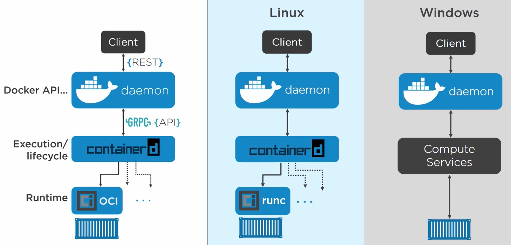

# Konfigurálás, telepítés

[Telepítés](./docker-install.md)

Bevezetés
=========

Mi az a Docker és miért jó?
---------------------------

> *A Docker egy olyan virtualizációs platform, amely alkalmazások konténerekben való fejlesztésére, szállítására és futtatására szolgál.*

### Mi az a virtualizáció?

Röviden összefoglalva abban az esetben beszélhetünk virtualizációról, amikor egy hardveren több (virtuális) rendszer működik egyszerre, virtuális gépekben futó, önálló operációs
rendszerekben.

#### Miért jó, mire jó a virtualizáció?

A jelenleg elérhető szerver hardverek kapacitása sok esetben meghaladja a hardverre telepített rendszer erőforrás igényét. A kiemelt célrendszerektől eltekintve szinte valamennyi
rendszeren marad fel nem használt kapacitás, de még célrendszerek esetén is előfordul, hogy a nagy terhelés csak időszakosan jelentkezik, és a fennmaradó időben az eszköz
kapacitása kihasználatlan marad. A virtualizáció ezeket a szabad kapacitásokat célozza meg. A korábbi “egy rendszer, egy hardver” modell helyett a rendszereket kellően erős
hardverre vonja össze, és ennek az eszköznek az erőforrásait osztja el virtuális gépek formájában az egyes rendszerek között, így alkotva optimálisan kihasznált, ebből eredően
költséghatékony megoldást.

A virtualizációval járó összevonás egyik járulékos előnye, hogy a virtuális hardver egyfajta szabvány hardverfelületet biztosít az üzemeltetők számára, megkímélve őket a hardver
upgrade során felmerülő kompatibilitási, frissítési, illetve kiesési problémáktól.

### Mi az a konténerizáció?

- Míg a virtualizációnál közvetlen a hardvert osztjuk meg, itt ennek az erőforrások kiosztását egy már élő operációs rendszeren futó, konténer "motor" osztja el.
- A konténereknek nincsen saját operációs rendszerük, a szülő operációs rendszerre építenek.
    - Ez lehet egyaránt Windows és Linux alapú rendszer
    - Fun fact: Windows alatt használhatunk WSL-t vagy virtualizációt ( Hyper-V ), hogy Linuxos konténereket futtassunk. Linuxon viszont nem lehet Windowsosat

- A konténerek hihetetlenül pehelysúlyúak, indításuk/kezelésük időben és erőforrásban mindössze töredéke a virtuális gépekének

- [*How is Docker different from a virtual machine?*](https://stackoverflow.com/questions/16047306/how-is-docker-different-from-a-virtual-machine)

### Fejlesztés, szállítás, futtatás?

- Fejlesztés alatt álló kódunknak fix környezetet tudunk biztosítani
- Szállítás során, fix környezet az, ami a forráskódunkból gépikódot, vagy egyéb produktumot tud generálni
- Futtatás során fix környezetben tud élni/futni a termék

### A konténerizáció előnyei

- Izolált, "dobozolt" környezetben tudunk futtatni alkalmazásokat, rendszereket
    - Az alkalmazás elkülönül az infrastruktúrától (konténer = izolált környezet)

- Lightweight. Eldobható, gyorsan indítható, leállítható
    - Az erőforrásigények, akár megabájtban, akár hardverben, egy komplett virtuális géphez képest elenyészőek

    - Egy konténer pillanatok alatt elindítható. Egy virtuális gép felhúzása ellenben legjobb esetben is minimum percekbe telik.

- "But it runs on my machine!!" - Infrastructure as code
    - Konténerizált alkalmazás bárhol futtatható, nincs "az én gépemen működik" probléma

### A konténerizáció hátrányai, virtualizációval szemben

- Nem egy "silver-bullet" minden esetre, problémára. Pl.: monolith alkalmazásoknál célszerűbb lehet a virtualizációt használni.
- Ehhez kapcsolódva, előfordulhat, hogy egy VM alatt egyszerűbb lehet egy tipikus OS + infrastruktúra + konfiguráció szentháromságba elhelyezni az alkalmazásunkat, mint megkeresni
  a megfelelő építő kockákat a konténeres világban.
- Alacsonyabb szintű izoláció VM-hez képet. Ugyanazon a kernelen, OS-en osztoznak a konténerek.
- Hajlamosabbak "elburjánzani". Mivel az indításuk, skálázásuk jóval egyszerűbb és kézenfekvőbb, könnyen megeshet, hogy végül több erőforrást szívnak fel.

**A Docker csak egy, a platformok közül. Néhány alternatíva:** [*6 Docker Alternatives and Other Types of Container
Tools*](https://jfrog.com/knowledge-base/6-alternatives-to-docker-all-in-one-solutions-and-standalone-container-tools/)

Docker ökoszisztéma
-------------------

​    **Docker Hub:** hivatalos és nem hivatalos képfájlok forrása, nyilvános és private registry is lehet

​    **Docker Desktop:** Kliens alkalmazás, Docker kezeléséhez felhasználói felület

​    **Docker Compose:** Több komponensből álló alkalmazások összeállítása

​    **Docker Machine/Swarm:** Skálázás és távoli menedzsment

​    **Kubernetes (aka. K8):** Konténerizációs koncepciókra épít, segítségével lehetőségünk van konténer orkesztrációra. Leegyszerűsítve, sok konténert, és az ő kapcsolatukat,
skálázásukat tudjuk általa kezelni.

Szakmai zsargon
---------------

**Image**

- Tekinthetünk rá egy statikus (csak olvasható) sablonként/templateként. Ezekből tudunk létrehozni/indítani konténereket. Rengeteg bázis image áll rendelkezésünkre, amik
  ‘out-of-the-box’ működőképesek.

> [*Docker Hub*](https://hub.docker.com/)

- Amiket egy image tartalmaz

    - OS fájlokat, objektumokat

    - Applikációhoz tartozó fájlokat

    - "Manifest" - Leírás ezek kapcsolódásáról

**Konténer**

- Az image felhasználásával indított példány az alkalmazásból

- Itt már kapunk egy írható/olvasható réteget is. (A rétegekről később) Ezáltal a konténerek tartalma már képes változni

**Docker Engine**

- Egy szolgáltatás, daemon. Ő kezeli az image-ket és a konténereket

“The Low-level stuff”
=====================

A konténerizációs technológiák, már jóval a Docker megjelenése előtt is léteztek és használták ezeket. Erre a Linux "primitívjeit" használták, ahol kézzel kellett konfigurálni a
konténer izolációjához szükséges erőforrásokat.

**Névterek - namespaces**  
Ezek segítségével megoldható, hogy a globális rendszererőforrások egy bizonyos folyamathoz legyenek allokálva.

- **Folyamatazonosító**: Mikor létrehozunk egy ilyen névteret, egy folyamattal, a névtéren belül ez a folyamat 1-es azonosítót fogja kapni, ő lesz az úgynevezett root process. A
  konténeren kívülről viszont ennek biztosan valami eltérő azonosítója lesz.
- **Hálózat**: Ezek a névterek teljesen önálló/izolált hálózattal is rendelkeznek, ők úgy fogják látni, hogy egy saját, dedikált hálózati interfészük van.
- **Fájlrendszer**: Biztosítunk egy, csak a konténer számára elérhető fájlrendszert, amit ő szintén a sajátjának lát belülről.
- **Felhasználó**: Szintén teljesen egyedi felhasználónk és felhasználói csoportunk van.

**Control Groups - cGroups**  
Erőforrások allokálása és korlátok meghatározása a konténerekhez. Konténer szinten beállíthatunk használati korlátokat, mint például memória, processzoridő.

Hello ~~World~~ Docker!
=======================

[*Docker*](https://www.docker.com/)

Docker változatok
-----------------

Mielőtt belevágunk az alábbi két paranccsal ellenőrizhetjük, hogy elérjük-e a dockerünket
-----------------------------------------------------------------------------------------

- `**docker version**`
    - Docker verzió

- **`docker info`**
    - Részletes információk

- **`docker stats`**
- docker erőforrás monitorozás

Miután telepítettük a Dockert a gépünkre, terminálból adjuk ki az alábbi parancsot:
-----------------------------------------------------------------------------------

- **`docker run hello-world`**
- **Ha Linuxon nem akar sudo-nélkül működni, adjuk hozzá az aktuális userünket a ‘docker’ user-grouphoz**
    - **`sudo adduser ubuntu docker`**

        - Ezután mindenképpen kelleni fog egy login/logout, esetenként egy reboot. Viszont ha mindent jól csináltunk, nem lesz szükségünk a sudo parancsra.

Azon kívül, hogy egy csomó minden kiíródott a konzolra, nem sok minden történt látszólag. A háttérben viszont rengeteg folyamat lezajlott:

- A Docker megnézte, hogy a *hello-world* image-ből található-e letöltve példány
- Mivel nem talált (még hozzá *:latest* taggel, erről később) ezért letöltötte a Docker Repositoryból, alapértelmezetten a DockerHub-ról
- Létrehozott az imageből egy konténert
- Elindította a konténert, amit elindítva visszaadott nekünk a konzolra egy hosszú üzenetet
- Leállította a konténert

**Ellenőrizhetjük ezeket, a következő parancsokkal:**

- ***`docker image ls`***
    - kilistázhatjuk a gépen lévő imageket

- `docker image rm`
- `docker image prune`
- `docker ps`
    - ez kilistázza az összes **futó** konténerünket jelen esetben ez nem fog semmit listázni, hiszen a konténer le is állt
    - `docker ps -a`
        - ezzel a futó konténereken felül a leállított/leállt szintén kilistázhatjuk

**Töröljük a létrehozott konténert, és imaget**

- `docker rmi <image-name:tag> / `
    - image törlése
- `docker rmi $(docker image ls -q)`
    - ÖSSZES “dangling” image törlése

- `docker rm <container-name> / <container-id>`
    - konténer törlése

- `docker rm $(docker ps -aq)`
    - ÖSSZES konténer törlése:

- `docker rm -f $(docker ps -aq)`
    - A jelenleg futó konténerek IS

Image-ek további kezelése
-------------------------

- `docker search nginx`
    - Imagek keresése
    - Sajnos tag-ekra nincs lehetőségünk szűrni, listázni őket (az írás pillanatában)

- `docker image pull <image-name:image-tag>`
    - A DockerHub-ról / repositoryból / registryből tudunk lehúzni tetszőleges imageket

    - Fontos, hogy csak azért, mert az van odaírva, hogy *latest*, az az image még nem feltétlenül a legfrissebb verziót tartalmazza, amennyiben ez nincs konzisztensen kezelve a
      felhőben és/vagy a gépünkön!

    - Jó tanácsok:
        - Amennyiben lehet, mindig ***official*** imageket használjunk

        - Ha valamelyik alkalmazásból nincs base-image, és kénytelenek vagyunk sajátot készíteni, akkor egy official-t vegyünk alapul

        - Kerüljük a *:latest* tag használatát, használjunk explicit verziószámokat
    - Amit letöltésnél érdemes megnézni, az a letöltés folyamata:

> 
>
> Itt a különböző sorok, különböző rétegeket jelölnek az image-n belül. Ezek a rétegek egymás tetejére épülnek, és különböző fájlokat tartalmaznak, amik meghatározzák, hogy pontosan miből is fog végül felépülni az imageünk.
>
> Valahogy így:
>
> 

- `docker image inspect <image-name:image-tag>`
    - Bővebb információk lekérése imageről

## Fájlrendszer működése

## Gyakorló feladatok

1. Keress egy _official_ MySQL image-t a _hub.docker.com_-ról
2. Írd meg a parancsot, ami letölt belőle egy konkrét verziót
3. Írd meg a parancsot, ami ebből indít egy példányt
4. Írd meg a parancsot, ami leállítja, majd letörli ezt a konténert
5. Írd meg a parancsot, ami letörli a hozzá tartozó imaget
    1. Név alapján
    2. Id alapján
    