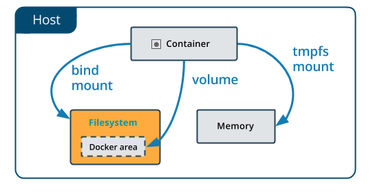

# Hozzunk létre saját Docker imaget!

[*Dockerfile reference | Docker Documentation*](https://docs.docker.com/engine/reference/builder/)

Hogyan is néz ki ez a gyakorlatban?

1. Szükségünk lesz, egy már működő alkalmazásra (my-server.jar) ✅

2. Készítünk egy *Dockerfile* nevű fájlt, ez fogja leírni, hogyan épül fel az image-ünk

3. Létrehozzuk a fájlból az imaget

4. Elindítjuk a saját image-ünkből a konténert

5. (Opcionális) Jelentkezzünk be a hub.docker.com-ra CLI-ből. Szükségünk lesz egy már létező Docker felhasználói fiókra.

6. (Opcionális) Publikáljuk a saját name-spaceünkbe az imaget

1\. Az alábbi java szerverünket fogjuk használni: [*my-server,jar*](./custom-image/my-server.jar)

2\. A Dockerfile egy egyszerű szöveges fájl, egy saját szintaxissal, ami megmondja, hogy egy image-nek hogyan kell felépülnie. **Note: A fájlnév is fontos!**

- Hozzuk létre a fájlt. `touch Dockerfile`
- Majd másoljuk be a következő snippetet

```dockerfile
FROM eclipse-temurin:11
LABEL maintainer="work@email.address"
RUN mkdir /app
COPY ./my-server.jar /app
WORKDIR /app
EXPOSE 8080
ENTRYPOINT ["java","-jar","./my-server.jar"]
```

3\. Futtassuk az alábbi parancsot:

- `docker image build -t my-name-java-app:0.0.1 .`
    - Ezzel készítünk a leíró Dockerfile-ból, egy használható imaget

    - **‘-t’** - egyedi nevet adhatunk a létrehozandó imagenek

    - **‘ . ‘** - a parancs végén a pont arra utal, hogy milyen kontextust használjon az image építése közben. A fájlban lévő útvonalak ezekhez képest lesznek relatívak.
    - Fontos, hogy ebben az esetben nem fogjuk tudni publikálni az imaget, ahhoz, hogy ez működjön meg kell adni az image nevében, hogy melyik name-space alá akarjuk hogy kerüljön:
        - `docker image build -t my-docker-username/my-name-java-app:0.0.1 .`

4\. Indítsuk el az image-ből a konténert:

- `docker run -d -p 4001:8080 my-name-java-app:0.0.1`
    - **‘-d’** - kapcsolóval szervízként/daemon-ként indítjuk a konténert --> háttérben
    - **‘-p’** - kapcsolóval tudunk nyitni a világ felé portokat
        - port-forwarding-ként működik

5\. Bejelentkezés

- `docker login -u username docker.io`

- Ez szükséges ahhoz, hogy publikálhassuk a saját docker felhasználónk alá

6\. Publikálás

- `docker image push my-username/my-name-java-app:0.0.1`

Dockerfile
----------

- **FROM**

    - **FROM openjdk:11.0.13-jre-slim-buster**

    - Megadhatjuk vele, hogy melyik bázis imaget használjuk

- **LABEL**

    - **LABEL maintainer="magyar.attila@qtc-kft.com"**

    - Meta-információkat adhatunk meg az imagehez, opcionális

- **RUN**
    - **RUN \["mkdir", "/app"\]**

    - **RUN mkdir /app**

    - Parancssorból futtathatunk parancsokat

- **COPY** vs. **ADD**
    - **COPY ./\*html /usr/share/nginx/html**

    - ADD a régebbi, némileg több funkcionalitással bír, például másolás http-n keresztül. Mégis a COPY a javasolt parancs, hacsak nem indokolt az ADD.

- **EXPOSE**
- **EXPOSE 80**
- **EXPOSE 80/tcp**

- Megadhatjuk, hogy milyen portokat szeretnénk kinyitni a világ felé, nem szolgál különösebb funkcionalitással, elsősorban inkább dokumentálja a működést.


- **ARG**
    - **ARG my_arg**
    - Előre definiálhatunk vele változó neveket, ha itt nem adunk meg default értéket, akkor a build során hibát fogunk kapni.

- **ENV**
    - **ENV MY\_VAR=my-value**

    - Különböző környezeti változókat állíthatunk be

- **ENTRYPOINT** vs. **CMD**
    - **ENTRYPOINT \["/entrypoint.sh"\]**
        - **ENTRYPOINT** mindeképpen le fog futni a konténer indulásakor, hacsak `--entry-point` kapcsolóval felül nem írjuk

    - **CMD \["echo","hello world!"\]**
        - Ez a parancs csak abban az esetben fog lefutni, amennyiben nem adunk meg docker run kiadásakor egyéb parancsokat. Pl.:
        - `docker run my-image`
            - Ebben az esetben le fog futni a **CMD**-ben megadott parancs

        - `docker run my-image ls`
            - Ebben az esetben felülírjuk, nem fog lefutni csak az `ls` parancs


- **VOLUME**
    - **VOLUME \["/usr/share/nginx/html"\]**
    - Lehetőség van konfigurálni egy kötetet, és azt bekötni a konténerünk belsejébe. Ez anonym kötetként fog létrejönni.
    - Fontos, hogy **csak** a konténer**ben** lévő helyet adhatjuk meg, a külsőt nem tudjuk módosítani.

- **HEALTHCHECK**
    - https://docs.docker.com/engine/reference/builder/#healthcheck

    - Lehetőségünk van healthcheckeket implementálni a segítségével

    ```
    FROM nginx:latest
    HEALTHCHECK CMD curl http://localhost
    ```

[*Dockerfile best practices - stories from the field*](https://www.pixelite.co.nz/article/dockerfile-best-practices/)


## Dockerignore

Mikor kiadjuk a `docker build .` parancsot, a parancs végén lévő ponttal határozzuk meg a *build contextet*. Ezt a környezetet fogja használni a docker buildelés közben. Ez azért
lehet fontos, hiszen ha például kiadunk egy `COPY . ./dir-in-container` parancsot, akkor a Docker a kontextben lévő összes fájlt át fogja másolni.

**De mi van akkor, ha szeretnénk bizonyos fájlokat kihagyni?**

Bizonyos esetekben nincs rá lehetőség, hogy a context könyvtárából eltávolítsunk olyan fájlokat, amiket nem szeretnénk bemásolni a konténerbe, ilyenkor lehetőségünk van létrehozni
egy úgynevezett `.dockerignore` fájlt. Ezt a fájlt a `Dockerfile`-unk mellé kell létrehozni majd ez automatikusan betöltésre kerül az image buildje során.

Nincs is más dolgunk, mint hogy felvegyünk az ignorálni kívánt fájlokat, és a Docker ezeket automatikusan ki fogja hagyni.

Példafájl

```.dockerignore
# A context rootjában lévő some-folder-re vonatkozik
./some-folder
some-folder


# Bármely mappán belüli some-folder-re vonatkozik
**/some-folder

# A some-folder-en belül mindenre vonatkozik
some-folder/**

# A some-folder-en belül minden .json kiterjesztésű fájlra vonatkozik
some-folder/*.json
```

Amiket általában célszerű itt megemlíteni ( a teljesség igénye nélkül)

- .git mappa
- build logok
- teszt szkriptek/eredmények
- átmeneti fájlok
- cache fájlok
- jelszavak, bizalmas adatok
- egyéb, helyi fejlesztési fájlok, pl.: docker-compose.yml
- *node_modules, .idea, build, target*... mappák

Commit
------

Amennyiben futó konténerben szeretnénk babrálni, majd annak az állapotát megőrizni, hogy újra indítható legyen belőle egy másik konténer, lehetőségünk van az aktuális állapotot
be-commitolni.

- `docker commit <container-name> <image-name:tag>`


## Gyakorló feladatok

1. Teszteld a .dockerignore-t működés közben. Egészítsd ki az előző feladatot!

    1. Hozz létre egy `hello.txt` fájlt a Dockerfile mellé
    2. Módosítsd úgy, hogy a build során másolja be a `hello.txt` fájlt a `/unignored-stuff` mappába.
    3. Legyen olyan file-od is (akár több is) a mappában, amit nem akarsz a konténerbe bemásolni!
    4. Adj hozzá minden szükségeset a `.dockerignore`-hoz, hogy a txt-n kívül, semmi mást ne másoljon át build közben!

Stateful, Stateless container/app - Kötetek
===========================================

Megfelelően használva a konténerek teljesen izoláltak, és állapotmentesek. Ez azt jelenti, hogy ha bármi módosítást csinálunk ezek belsejében, azok csak a lokális konténerben
lesznek jelen, de ha új konténert csinálunk ugyanabból az image-ből, azok az adatok el fognak tűnni.

Fontos, hogy futási időben ezek megmaradnak, és csak másik konténer indítása esetén fognak elveszni!

Mikor nem számít ez?

- A konténerek belsejében alapjában véve helytelen "matatni", de tesztelésre, fejlesztésre nekünk ez jó lehet

Mikor lehet rá szükség, hogy megőrizze az állapotát?

- Adatbázis szervernél, ahol hosszú távon szeretnénk megőrizni az adatainkat, abban az esetben is, ha esetleg több fizikai helyen fut az a konténer

Ahhoz, hogy meg tudjunk bármi adatot **hosszú távon** őrizni, egy írható, perzisztens részt kell létrehoznunk, és beállítanunk a konténerhez. Úgynevezett köteteket (*volume*) kell
létrehoznunk.



Erre három lehetőségünk van:
- **bind mount**: egy a gazdagépen lévő könyvtárat (vagy fájlt) felcsatolunk a konténer fájlrendszerének egy elérési útjára, ennek eredményeként a konténer az adott elérési úton a megadott fogja használni a saját írható rétege helyett.
    - elérhető a Docker engine-től függetlenül
    - ha nem létezik a megadott elérési út, akkor könyvtárként létrehozza
    - nem tölthető fel a csatolás előtt a konténerben található adatokkal
    - a bekötni kívánt könyvtár abszolút elérési útját adjuk meg
    - `docker run -d --name <name_of_container> -v mysqldata:/var/lib/mysql -p 80:8080 mysql:latest`

      > **-d** detach, run in background
      >
      > **--name** név megadása
      >
      > **-v mysqldata:/var/lib/mysql** named-volume mountolása
      >
      > **-p** port-mapping

- **volume**: a Docker által kezelt kötet jön létre, amit csatolhatunk a konténerben egy könyvtárhoz (filehoz).
    - nem nyúlhatunk bele "kívülről", csak a Docker kezelheti.
    - lehet anonym és nevesített
    - a Docker támogatja a backupolását és migrálását
    - `docker volume create <volume-name>`
        - létrehoz egy kötetet a megadott névvel

    - `docker volume ls`
        - kilistázza a jelenlegi köteteket

    - `docker run -v <volume-name>:/path/to/attach/inside/container `

- **tmpfs**
    - ideiglenes kötetet hoz létre
    - nem perzisztens
    - nagyon gyors, csak a gazdagép memóriájában tárolódik

Mindhárom esetben kétféle kapcsolót használhatunk:
- **-v** (avagy --volume) : lásd feljebb
- **--mount** : terjengősebb, kulcs-érték párok formájában adjuk meg


## Gyakorló feladatok

1. HTML tartalom kiszolgálása kötetből
    1. Indíts egy nginx konténert úgy, hogy
    2. Legyen neki bekötve a host gép fájlrendszerén egy tetszőleges mappa kötetként
    3. Kapjon egy portot a host gépen, hogy el tudjuk érni a konténer által kiszolgált tartalmat
    4. Hozz létre ebben a mappában egy index.html nevű fájlt
    5. Ellenőrizd, hogy az általad meghatározott tartalmat szolgálja-e ki!
    6. (Ha nem, akkor temészetesen tovább kell próbálkozni) ;)
2. Kötetek megosztása konténerek között
    1. Hozz létre 3 különböző tetszőleges konténert.
    2. Mindegyikbe kösd be, a `/shared-stuff` mappába egy tetszőleges lokális könyvtárat ( **Mindegyikhez ugyanazt!** )
    3. Hozz létre ebbe a könyvtárba egy tetszőleges fájlt
    4. Ellenőrizd, hogy a fájlok láthatóak-e a konténer belsejéből
    5. Hozz létre a csatolt útvonalon egy fájlt, de a konténer belsejéből!
    6. Az előzőt kiegészítve, a csatolt könyvtár legyen csak olvasható a konténerek számára!
    7. Próbálj meg így létrehozni, vagy törölni egy fájlt ebben a könyvtárban a konténer shelljéből!
    

